# Google 表格客户线索邮件自动通知系统

> 当前版本：**v1.1.0**  
> 技术组合：**Google Sheets + Google Apps Script + Gmail**

本项目用于把 Google 表格中的新客户线索，自动整理成邮件并发送到指定的业务邮箱，同时在表格中记录发送状态，避免重复通知。

当前版本已经结合实际使用中遇到的问题完成优化，重点解决了：

- 脚本读取到错误工作表，导致 `Missing required columns: customer_email`；
- 表头存在空格、BOM 或零宽字符时无法识别；
- 测试邮件被 Gmail 归入垃圾邮件；
- 邮件正文包含过多无关字段；
- 手动测试和定时触发器同时运行时可能重复发送；
- Gmail 当日发送额度不足时缺少明确提示。

---

## 目录

- [一、项目功能](#一项目功能)
- [二、运行流程](#二运行流程)
- [三、当前邮件字段](#三当前邮件字段)
- [四、字段与邮箱的区别](#四字段与邮箱的区别)
- [五、项目目录](#五项目目录)
- [六、部署前准备](#六部署前准备)
- [七、完整安装步骤](#七完整安装步骤)
- [八、核心配置说明](#八核心配置说明)
- [九、发送状态与防重复机制](#九发送状态与防重复机制)
- [十、如何修改邮件字段](#十如何修改邮件字段)
- [十一、常见错误与排查](#十一常见错误与排查)
- [十二、邮件进入垃圾箱的处理](#十二邮件进入垃圾箱的处理)
- [十三、自动触发器管理](#十三自动触发器管理)
- [十四、安全与隐私建议](#十四安全与隐私建议)
- [十五、实战问题复盘](#十五实战问题复盘)
- [十六、版本更新记录](#十六版本更新记录)
- [十七、文件说明](#十七文件说明)

---

## 一、项目功能

本系统适用于以下场景：

- Facebook / Instagram 广告表单线索通知；
- Google 表格客户询盘自动提醒；
- 销售人员或代理商线索分发；
- 小规模 CRM 邮件通知；
- 每日少量或中等数量客户线索自动转发。

当前脚本具备以下功能：

1. 通过 `SPREADSHEET_ID` 和工作表 `gid` 精确读取目标工作表；
2. 自动识别第一行字段名；
3. 读取 `customer_email` 列中的第一个非空邮箱；
4. 把每一条未发送线索整理成 HTML 邮件；
5. 发送成功后写入 `Sent`；
6. 记录发送时间；
7. 记录单条线索的错误信息；
8. 已发送记录不会重复发送；
9. 支持单条测试；
10. 支持每 5 分钟自动运行；
11. 使用脚本锁防止并发重复发送；
12. 自动检查 Gmail 当日剩余发送额度；
13. 自动清理表头中的空格、BOM 和零宽字符。

### 不适合的场景

本项目是内部业务通知工具，不适合作为营销群发平台。

| 场景 | 建议 |
|---|---|
| 每天几十条线索 | 适合 |
| 每天上百条线索 | 需要关注 Gmail 配额 |
| 内部销售通知 | 适合 |
| 批量营销邮件 | 不建议 |
| 需要退订、追踪和营销统计 | 建议使用专业邮件服务 |

---

## 二、运行流程

```text
广告或表单产生客户线索
        ↓
线索写入 Google 表格
        ↓
Apps Script 定时扫描表格
        ↓
跳过 email_send_status = Sent 的记录
        ↓
读取 customer_email 作为通知接收邮箱
        ↓
提取 6 个客户字段并生成邮件
        ↓
通过 Gmail 发送通知
        ↓
回写 Sent、发送时间或错误信息
```

### 参与组件

| 组件 | 作用 |
|---|---|
| Google Sheets | 保存客户线索和发送状态 |
| Google Apps Script | 读取数据、生成邮件、发送邮件 |
| Gmail | 实际发出通知邮件 |
| 时间触发器 | 每 5 分钟自动执行脚本 |

邮件会从**授权并运行 Apps Script 的 Google 账号**发出。

---

## 三、当前邮件字段

当前邮件正文只发送以下 6 个字段：

| 表格字段 | 邮件显示名称 | 用途 |
|---|---|---|
| `business_type` | 客户类型 | 例如 homeowner |
| `requirements` | 客户需求 | 客户填写的具体需求 |
| `full_name` | 客户姓名 | 线索姓名 |
| `phone_number` | 联系电话 | 客户联系电话 |
| `email` | 客户邮箱 | 线索客户自己的邮箱 |
| `street_address` | 客户地址 | 客户地址 |

字段位置示例：

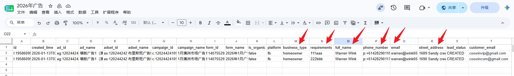

### 邮件标题示例

```text
新客户询盘通知｜Warren Wink｜homeowner
```

### 邮件正文示例

```text
新客户询盘

客户类型：homeowner
客户需求：111aaa
客户姓名：Warren Wink
联系电话：+61428290116
客户邮箱：warren@example.com
客户地址：1689 Sandy Creek Road
```

字段为空时，HTML 邮件中会显示：

```text
-
```

---

## 四、字段与邮箱的区别

这是本项目中最容易混淆的地方。

| 字段 | 含义 |
|---|---|
| `email` | 线索客户自己的邮箱，显示在邮件正文中 |
| `customer_email` | 接收线索通知的业务邮箱，不显示在正文中 |

系统的实际逻辑是：

```text
读取客户的 email、电话、姓名等信息
        ↓
统一发送到 customer_email
```

### `customer_email` 的填写方式

如果所有线索都发送到同一个邮箱，可以只在该列填写一个有效邮箱。

脚本会从上到下查找 `customer_email` 列，并使用第一个非空邮箱作为统一接收邮箱。

例如：

```text
customer_email
coowinvip@gmail.com


```

> 当前版本不是“每一行发给不同邮箱”的模式。如果以后需要按行分配不同收件人，需要调整接收邮箱逻辑。

---

## 五、项目目录

```text
google-sheets-lead-email-automation/
├── README.md
├── CHANGELOG.md
├── .gitattributes
├── src/
│   ├── Code.gs
│   ├── Code.txt
│   └── Google-Sheets-test-URL.txt
└── assets/
    └── screenshots/
        ├── 01-sheet-overview.png
        ├── 02-customer-email-column.png
        ├── 03-open-apps-script.png
        ├── 04-paste-code.png
        ├── 05-save-project.png
        ├── 06-run-test-function.png
        ├── 07-authorize-script.png
        ├── 08-execution-log-success.png
        ├── 09-sheet-status-sent.png
        ├── 10-gmail-sent-preview.png
        ├── 11-create-trigger.png
        ├── 12-trigger-list.png
        ├── 13-missing-column-error.png
        ├── 14-fixed-execution-log.png
        ├── 15-email-fields.png
        └── README-screenshots.md
```

---

## 六、部署前准备

部署前确认以下内容：

- 已有一个 Google 表格；
- 第一行是字段名；
- 表格中存在当前脚本需要的 7 个业务字段；
- 已准备一个接收通知的邮箱；
- 当前 Google 账号有权访问该表格；
- 当前 Google 账号可以使用 Gmail 发信。

### 必须存在的字段

```text
business_type
requirements
full_name
phone_number
email
street_address
customer_email
```

### 脚本自动新增的字段

首次运行时，脚本会自动在表格末尾新增：

```text
email_send_status
email_sent_time
email_error_message
```

不要手动把这些字段改名，否则脚本可能无法判断发送状态。

---

## 七、完整安装步骤

### 步骤 1：检查 Google 表格

第一行必须是字段名，第二行开始才是数据。

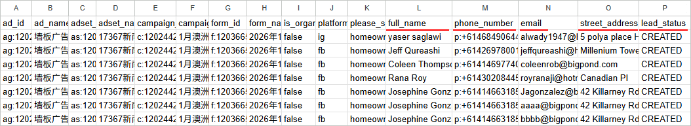

重点确认：

```text
business_type
requirements
full_name
phone_number
email
street_address
customer_email
```

字段名必须和代码配置一致。

---

### 步骤 2：设置通知接收邮箱

在表格中新增或确认：

```text
customer_email
```

然后填写接收线索通知的邮箱。

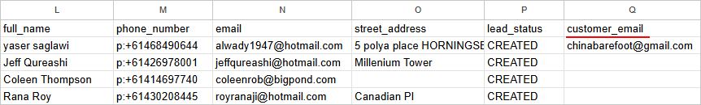

注意：

- `email` 是客户邮箱；
- `customer_email` 是业务通知邮箱；
- 两者不能混用。

---

### 步骤 3：获取表格 ID 和工作表 gid

Google 表格地址通常类似：

```text
https://docs.google.com/spreadsheets/d/表格ID/edit?gid=工作表gid
```

例如：

```text
https://docs.google.com/spreadsheets/d/1AbCdEfGhIjKlMnOp/edit?gid=579167497
```

对应关系：

```text
SPREADSHEET_ID = 1AbCdEfGhIjKlMnOp
SHEET_ID       = 579167497
```

其中：

- `SPREADSHEET_ID` 用于定位整个 Google 表格文件；
- `SHEET_ID` 使用 URL 中的 `gid`，用于定位具体标签页。

使用 `SHEET_ID` 的原因是：

> 同一个 Google 表格文件可能有多个标签页。只读取第一个标签页，很容易读错工作表。

---

### 步骤 4：打开 Apps Script

在 Google 表格菜单中点击：

```text
扩展程序 → Apps Script
```

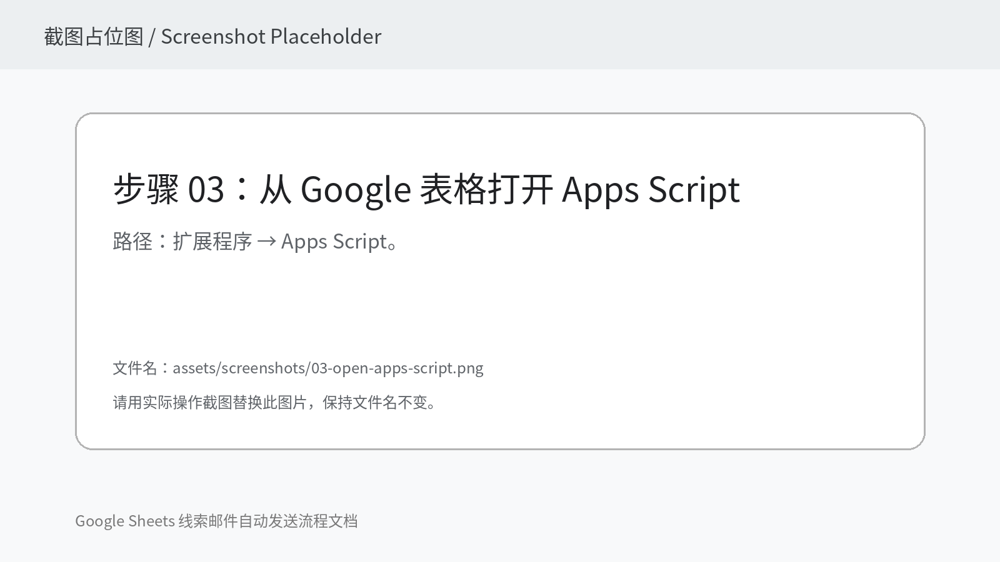

---

### 步骤 5：复制代码

删除 Apps Script 编辑器中的默认代码，然后复制：

```text
src/Code.gs
```

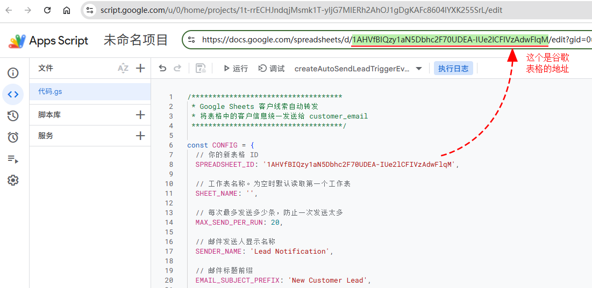

修改顶部配置：

```javascript
const CONFIG = {
  SPREADSHEET_ID: '你的表格ID',
  SHEET_ID: 你的工作表gid,

  MAX_SEND_PER_RUN: 20,
  SENDER_NAME: '昆州客户线索通知',
  EMAIL_SUBJECT_PREFIX: '新客户询盘通知',
  EMAIL_HEADING: '新客户询盘'
};
```

`SHEET_ID` 是数字，不需要引号：

```javascript
SHEET_ID: 579167497
```

---

### 步骤 6：保存 Apps Script 项目

点击顶部保存按钮。

建议项目名称：

```text
Google 表格客户线索邮件自动通知
```

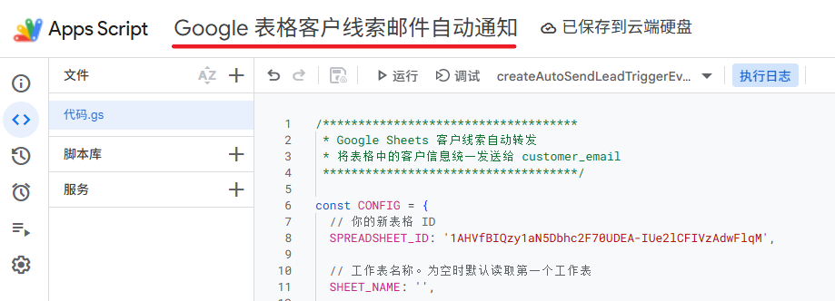

---

### 步骤 7：先运行表头调试函数

第一次部署时，建议先选择并运行：

```javascript
debugTargetSheetHeaders
```

执行日志应显示：

```text
工作表名称：目标标签页名称
工作表 gid：579167497
表头字段：["id","created_time",...,"customer_email"]
```

这一步可以提前确认：

- 是否读取到了正确的标签页；
- `gid` 是否正确；
- 字段名是否存在；
- 表头是否有拼写问题。

---

### 步骤 8：运行单条测试

在函数下拉框选择：

```javascript
testSendFirstLeadToCustomerEmail
```

然后点击“运行”。

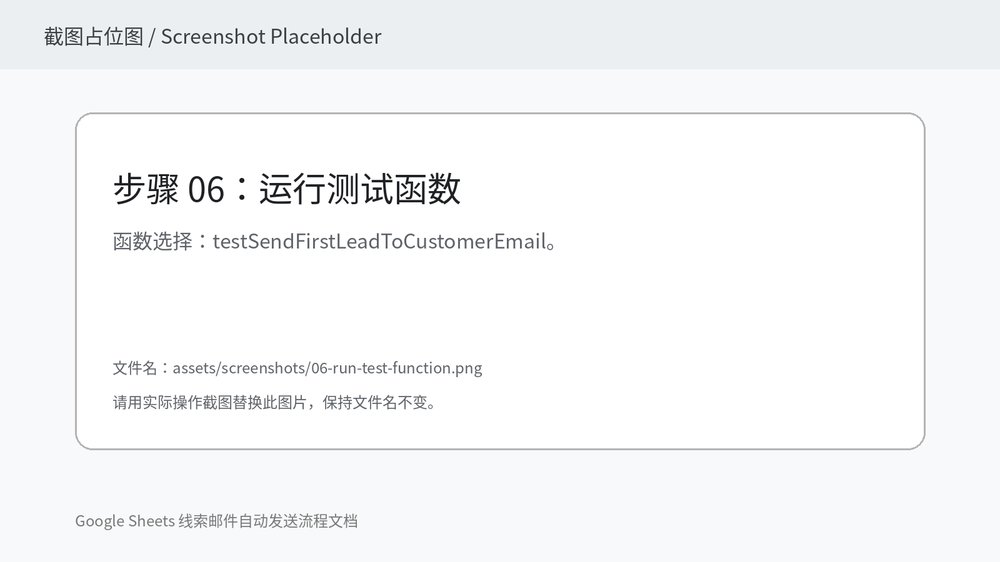

该函数每次只发送第一条尚未标记为 `Sent` 的记录。

---

### 步骤 9：完成首次授权

第一次运行时，Google 会要求授权。

一般流程：

```text
查看权限
→ 选择 Google 账号
→ 高级
→ 转到项目
→ 允许
```

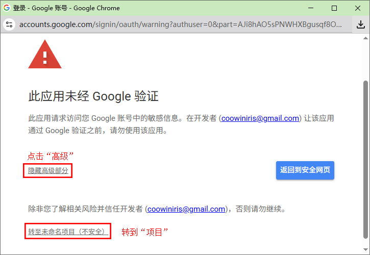

脚本需要以下权限：

- 读取和修改目标 Google 表格；
- 通过当前账号发送邮件；
- 创建和管理 Apps Script 触发器。

---

### 步骤 10：查看执行日志

成功日志类似：

```text
目标工作表：昆州客户自动群发表 | gid：579167497
通知接收邮箱：coowinvip@gmail.com
第 2 行发送成功，接收邮箱：coowinvip@gmail.com
本次共发送：1 封邮件
执行完毕
```

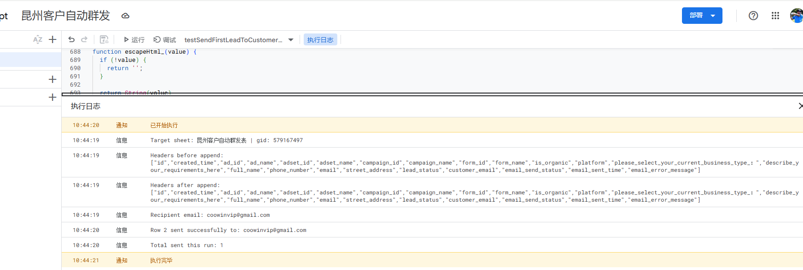

原项目中的成功日志截图：

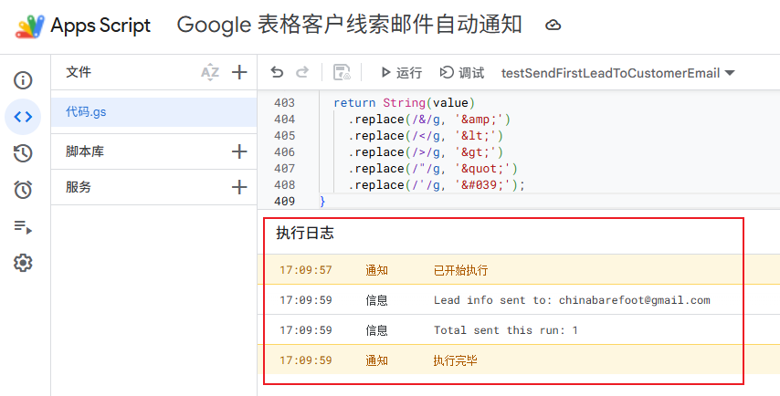

---

### 步骤 11：检查表格状态

发送成功后，当前行会写入：

```text
email_send_status = Sent
email_sent_time   = 实际发送时间
email_error_message = 空
```

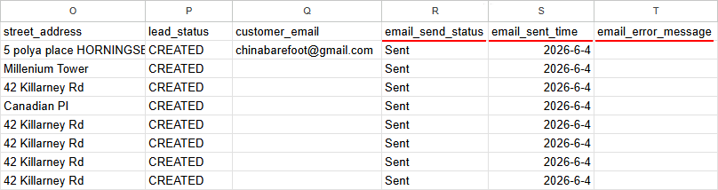

发送失败时：

```text
email_send_status = Failed
email_error_message = 具体错误原因
```

---

### 步骤 12：检查收到的邮件

确认以下内容：

- 收件人是 `customer_email`；
- 标题包含客户姓名和客户类型；
- 正文只显示 6 个指定字段；
- 客户电话、邮箱和地址格式正常；
- 邮件未进入垃圾箱。

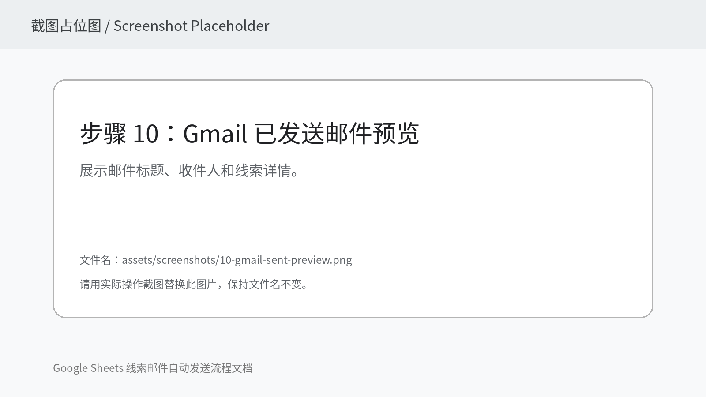

---

### 步骤 13：创建自动触发器

测试成功后，运行一次：

```javascript
createAutoSendLeadTriggerEvery5Minutes
```

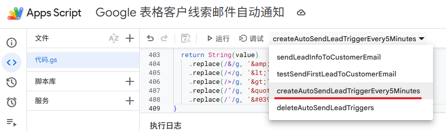

然后进入 Apps Script 左侧“触发器”，确认存在：

```text
函数：sendLeadInfoToCustomerEmail
来源：时间驱动
频率：每 5 分钟
```

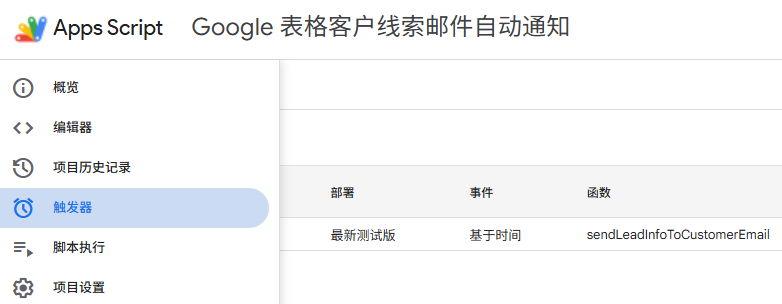

---

## 八、核心配置说明

### 1. 表格文件 ID

```javascript
SPREADSHEET_ID: '你的表格ID'
```

来自 URL 中：

```text
/d/ 与 /edit 之间
```

---

### 2. 工作表 gid

```javascript
SHEET_ID: 579167497
```

来自 URL 中：

```text
gid=579167497
```

当前版本通过 `SHEET_ID` 精确定位标签页，不再默认读取第一个工作表。

---

### 3. 每次发送数量

```javascript
MAX_SEND_PER_RUN: 20
```

表示每次脚本最多发送 20 条未发送线索。

测试函数会临时将其改为 1，结束后自动恢复。

---

### 4. 发件人显示名称

```javascript
SENDER_NAME: '昆州客户线索通知'
```

建议使用真实、明确、容易识别的名称。

不建议使用过于通用的名称，例如：

```text
Lead Notification
System Mail
No Reply
```

---

### 5. 邮件标题前缀

```javascript
EMAIL_SUBJECT_PREFIX: '新客户询盘通知'
```

最终标题由以下部分组成：

```text
标题前缀｜客户姓名｜客户类型
```

---

### 6. 邮件正文标题

```javascript
EMAIL_HEADING: '新客户询盘'
```

这是 HTML 邮件顶部显示的主标题。

---

## 九、发送状态与防重复机制

脚本通过以下字段判断是否重复发送：

```text
email_send_status
```

只要当前行状态是：

```text
Sent
```

脚本就会跳过这一行。

### 状态说明

| 状态 | 含义 |
|---|---|
| 空白 | 尚未发送 |
| `Sent` | 已成功发送 |
| `Failed` | 上次发送失败，可在下一次继续尝试 |

当前逻辑只跳过 `Sent`，因此 `Failed` 记录在后续运行时会再次尝试发送。

### 如何重新测试某一行

清空该行的：

```text
email_send_status
```

然后重新运行测试函数即可。

为了让状态更整洁，也可以同时清空：

```text
email_sent_time
email_error_message
```

> 清空 `Sent` 会使该记录重新发送，请避免误操作。

### 并发保护

脚本使用：

```javascript
LockService.getScriptLock()
```

防止以下情况同时发生：

- 手动点击运行；
- 定时触发器正在执行；
- 两次触发器运行时间重叠。

这样可以降低重复发送风险。

---

## 十、如何修改邮件字段

当前字段配置位于：

```javascript
COL_BUSINESS_TYPE: 'business_type',
COL_REQUIREMENTS: 'requirements',
COL_FULL_NAME: 'full_name',
COL_PHONE: 'phone_number',
COL_LEAD_EMAIL: 'email',
COL_ADDRESS: 'street_address'
```

### 修改字段时需要同步检查 4 个位置

1. `CONFIG` 中的字段名；
2. `validateRequiredColumns_()` 中的必需字段列表；
3. `extractLeadData_()` 中的数据提取；
4. HTML 和纯文本邮件生成函数。

对应函数：

```javascript
extractLeadData_()
buildLeadEmailHtml_()
buildLeadEmailText_()
```

### 只改邮件显示名称

例如把“客户地址”改成“项目地址”，只需修改：

```javascript
buildHtmlFieldRow_('项目地址', address)
```

和：

```javascript
'项目地址：' + (lead.address || '-')
```

### 新增一个字段

例如新增 `lead_status`，需要：

```javascript
COL_LEAD_STATUS: 'lead_status'
```

然后在 `extractLeadData_()`、HTML 邮件和纯文本邮件中同步增加。

不要只在 `CONFIG` 中新增字段，否则邮件正文不会自动显示。

---

## 十一、常见错误与排查

### 1. 报错：Missing required columns: customer_email

错误示例：

```text
Error: Missing required columns: customer_email
```

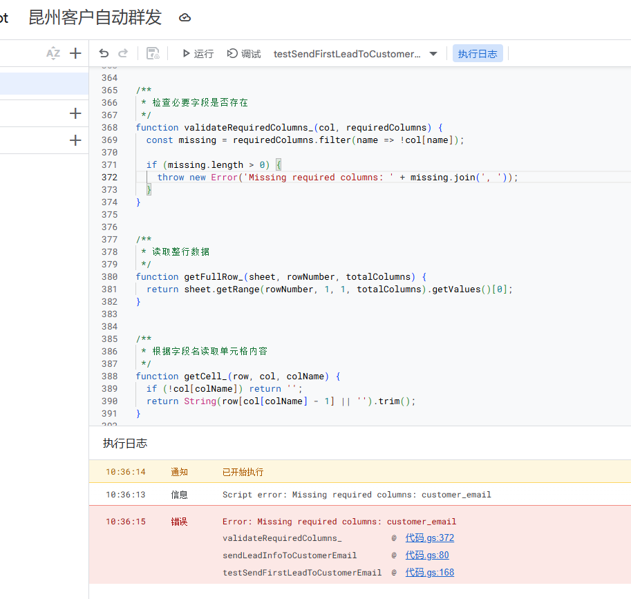

即使表格页面上能看到 `customer_email`，脚本仍可能报错。

#### 最常见原因：读错工作表

旧版逻辑可能使用：

```javascript
return ss.getSheets()[0];
```

这表示始终读取第一个标签页。

如果当前数据在第二个或其他标签页，脚本读取的表头里就没有 `customer_email`。

#### 当前修复方式

使用 URL 中的 `gid` 精确定位：

```javascript
SHEET_ID: 579167497
```

并通过：

```javascript
item.getSheetId() === CONFIG.SHEET_ID
```

找到目标标签页。

#### 排查步骤

先运行：

```javascript
debugTargetSheetHeaders
```

检查日志中的：

```text
工作表名称
工作表 gid
表头字段
```

只要日志中的 `gid` 不等于 URL 中的 `gid`，就说明读取错了工作表。

---

### 2. 页面能看到字段，但脚本仍提示缺少字段

可能是字段中存在肉眼看不到的字符，例如：

- 首尾空格；
- BOM；
- 零宽空格；
- 从其他系统复制过来的隐藏字符。

当前代码会自动执行：

```javascript
normalizeHeader_()
```

清理这些字符。

仍有问题时，可以：

1. 双击表头单元格；
2. 删除原内容；
3. 手动重新输入字段名；
4. 再运行 `debugTargetSheetHeaders`。

---

### 3. 报错：customer_email 列中没有找到接收邮箱

说明表头存在，但该列没有任何非空邮箱。

检查：

- 是否在 `customer_email` 列填写了邮箱；
- 是否填写在正确的工作表；
- 是否存在多余空格；
- 是否被公式返回为空字符串。

---

### 4. 报错：customer_email 邮箱格式无效

示例：

```text
customer_email 邮箱格式无效：coowinvip@gmail
```

正确格式应类似：

```text
coowinvip@gmail.com
```

---

### 5. 测试函数每次发送下一条记录

这是正常行为。

```javascript
testSendFirstLeadToCustomerEmail
```

每次只发送第一条尚未标记为 `Sent` 的记录。

第一条发送后成为 `Sent`，下一次运行会自动处理下一条。

---

### 6. 邮件没有发送，但脚本没有整体报错

查看该行：

```text
email_send_status
email_error_message
```

单条发送失败时，脚本会把该行标记为：

```text
Failed
```

并记录具体错误。

---

### 7. 当日发送额度不足

当前代码会先执行：

```javascript
MailApp.getRemainingDailyQuota()
```

如果额度已经用完，会提示：

```text
当前账号今天的邮件发送额度已经用完。
```

减少 `MAX_SEND_PER_RUN` 不能恢复当日额度，只能等待额度恢复或更换适合的发信方案。

---

### 8. 自动触发器没有运行

检查：

- 是否运行过 `createAutoSendLeadTriggerEvery5Minutes`；
- Apps Script 左侧是否存在触发器；
- 触发器是否有失败记录；
- 授权账号是否仍有表格和 Gmail 权限；
- 表格 ID 或 gid 是否后来发生变化；
- 是否修改过函数名称。

---

### 9. 修改代码后仍像在运行旧版本

可能原因：

- 没有保存；
- 函数下拉框仍选择旧测试函数；
- 项目中保留了同名旧函数；
- 触发器仍指向旧函数。

建议：

1. 保存代码；
2. 检查是否有重复函数；
3. 删除旧触发器；
4. 重新创建触发器。

---

## 十二、邮件进入垃圾箱的处理

脚本成功发送不代表邮件一定进入收件箱。首次使用自动通知系统时，Gmail 可能把模板化邮件归入垃圾邮件。

### 本项目实际有效的调整

将：

```javascript
SENDER_NAME: 'Lead Notification'
EMAIL_SUBJECT_PREFIX: 'New Customer Lead'
```

改为更明确的业务名称：

```javascript
SENDER_NAME: '昆州客户线索通知'
EMAIL_SUBJECT_PREFIX: '新客户询盘通知'
```

修改后，邮件识别度更高，也更符合真实业务通知场景。

### 建议操作

1. 在垃圾邮件中点击“不是垃圾邮件”；
2. 将发件账号加入通讯录；
3. 使用真实、稳定的发件人显示名称；
4. 避免短时间重复发送大量完全相同的测试邮件；
5. 邮件标题不要过于夸张或像营销群发；
6. 邮件正文保留明确的业务来源；
7. 使用长期稳定的业务账号发送；
8. 企业域名邮箱应检查自己的邮件认证配置。

当前邮件底部已经明确说明：

```text
本邮件由昆州客户线索通知系统自动发送，请及时处理。
```

这有助于收件人理解邮件来源。

---

## 十三、自动触发器管理

### 创建每 5 分钟触发器

只运行一次：

```javascript
createAutoSendLeadTriggerEvery5Minutes
```

该函数会先删除同名旧触发器，再创建新的触发器，防止重复创建。

### 停止自动发送

运行：

```javascript
deleteAutoSendLeadTriggers
```

也可以进入 Apps Script 左侧“触发器”页面手动删除。

### 是否需要一直打开电脑或浏览器

不需要。

触发器创建成功后，任务运行在 Google Apps Script 云端。电脑关闭、浏览器关闭，不影响定时执行。

---

## 十四、安全与隐私建议

### 1. 不要公开客户数据

表格中可能包含：

- 姓名；
- 电话；
- 邮箱；
- 地址；
- 客户需求。

建议：

- 表格保持私有；
- 仅授权必要人员访问；
- 不要把真实数据截图提交到公开仓库；
- README 截图中的电话、邮箱和地址应打码。

### 2. 公开 GitHub 仓库前检查配置

公开仓库前，建议检查：

```javascript
SPREADSHEET_ID
SHEET_ID
SENDER_NAME
```

并检查：

```text
src/Google-Sheets-test-URL.txt
```

虽然表格 ID 本身不等于访问权限，但不建议在公开仓库中保留真实业务地址。

### 3. 使用业务专用账号

建议使用专门的业务 Google 账号运行脚本，避免：

- 员工离职后权限丢失；
- 个人邮箱和业务通知混杂；
- 后期无法统一管理触发器和发件记录。

### 4. 定期检查触发器失败记录

建议定期进入 Apps Script：

```text
执行记录
触发器
```

检查是否存在连续失败。

---

## 十五、实战问题复盘

### 问题 1：表格明明有 customer_email，脚本却报缺少字段

现象：

```text
Missing required columns: customer_email
```

真正原因：

> 脚本读取了同一个 Google 表格文件中的错误标签页。

旧版配置把 `SHEET_NAME` 留空后，默认读取第一个工作表：

```javascript
ss.getSheets()[0]
```

而实际线索数据位于 `gid=579167497` 的标签页。

最终修复：

- 改为 `SHEET_ID`；
- 根据 `getSheetId()` 精确匹配；
- 新增 `debugTargetSheetHeaders()`；
- 自动清理隐藏表头字符。

修复后的日志：


---

### 问题 2：邮件发送成功，但进入垃圾箱

现象：

- Apps Script 日志显示发送成功；
- 收件邮箱能收到；
- 但邮件位于垃圾邮件。

调整：

```javascript
SENDER_NAME: '昆州客户线索通知'
EMAIL_SUBJECT_PREFIX: '新客户询盘通知'
```

结果：

> 使用明确、真实的业务名称和标题后，后续测试邮件不再进入垃圾箱。

---

### 问题 3：邮件正文包含的字段不符合实际需求

最终确认只发送：

```text
business_type
requirements
full_name
phone_number
email
street_address
```

同时保留：

```text
customer_email
```

仅作为收件地址，不显示在正文中。

---

## 十六、版本更新记录

### v1.1.0

- 通过工作表 `gid` 精确定位目标标签页；
- 修复 `Missing required columns: customer_email`；
- 新增 `debugTargetSheetHeaders()` 调试函数；
- 增加表头空格、BOM 和零宽字符清理；
- 邮件正文精简为 6 个指定字段；
- 新增 `requirements` 客户需求字段；
- 更新中文 HTML 邮件样式；
- 优化发件人名称和邮件标题；
- 使用对象参数调用 `MailApp.sendEmail()`；
- 增加有效 `replyTo`；
- 增加每日剩余邮件额度检查；
- 一次性读取表格数据，减少 API 调用；
- 增加脚本锁，降低重复发送风险；
- 完善中文日志、错误提示和代码注释；
- 新增真实问题排查和垃圾邮件处理说明。

### v1.0.0

- 完成 Google 表格客户线索读取；
- 支持发送到 `customer_email`；
- 支持写入发送状态；
- 支持单条测试；
- 支持每 5 分钟自动触发。

---

## 十七、文件说明

| 文件 | 说明 |
|---|---|
| `README.md` | 完整安装、配置、排错和维护指南 |
| `CHANGELOG.md` | 版本变更记录 |
| `src/Code.gs` | 可直接复制到 Apps Script 的完整代码 |
| `src/Code.txt` | 便于普通文本编辑器打开的代码副本 |
| `src/Google-Sheets-test-URL.txt` | 当前测试表格地址，公开仓库前应检查 |
| `assets/screenshots/` | 安装步骤、错误和修复效果截图 |
| `assets/screenshots/README-screenshots.md` | 截图命名说明 |

---

## 快速复用清单

在新项目中复用时，按以下顺序操作：

1. 复制 `src/Code.gs`；
2. 修改 `SPREADSHEET_ID`；
3. 修改 `SHEET_ID`；
4. 核对 7 个必要字段；
5. 填写 `customer_email`；
6. 运行 `debugTargetSheetHeaders`；
7. 运行 `testSendFirstLeadToCustomerEmail`；
8. 检查邮件和 `Sent` 状态；
9. 运行 `createAutoSendLeadTriggerEvery5Minutes`；
10. 定期查看执行记录和触发器状态。

至此，Google 表格客户线索邮件自动通知系统即可稳定运行。
